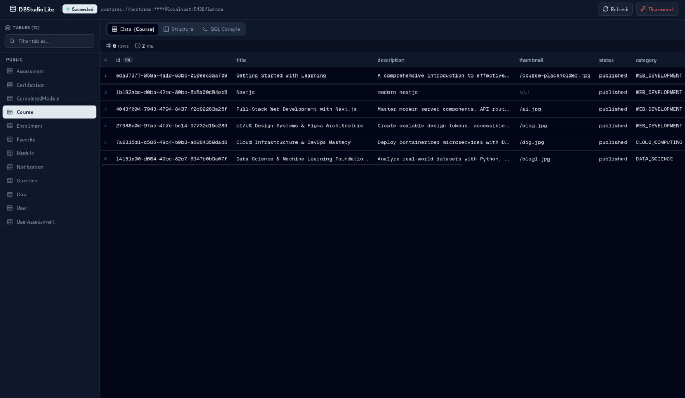
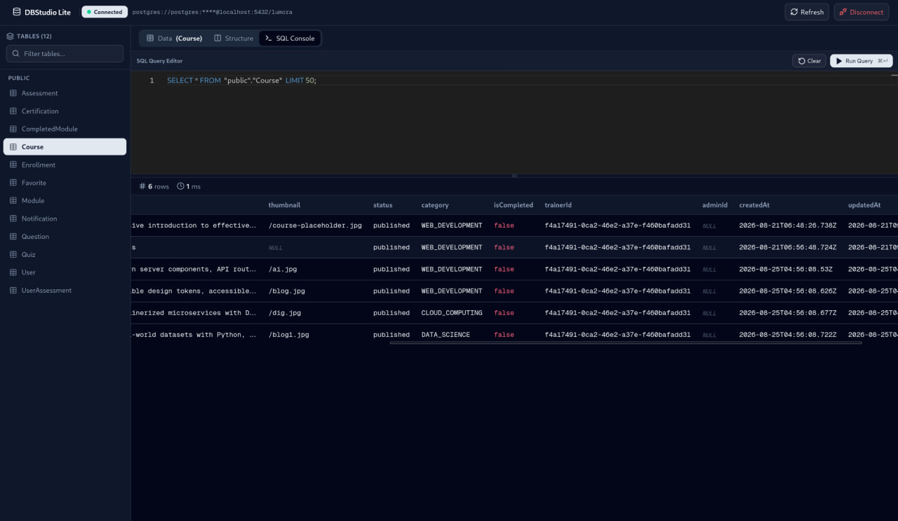
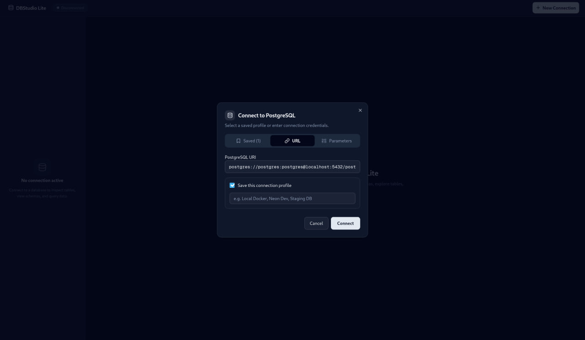
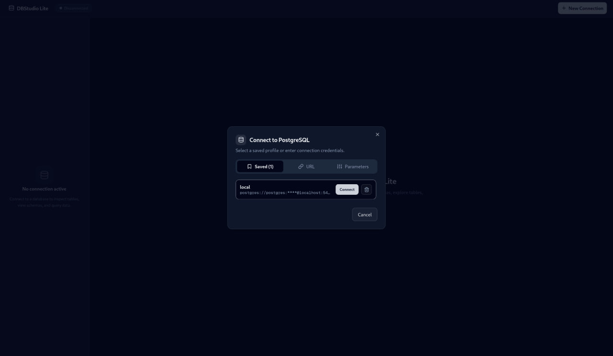

# DBStudio Lite

[](https://github.com/ruhamabek/dbstudio-lite/releases)
[](https://github.com/ruhamabek/dbstudio-lite/releases)
[](https://github.com/ruhamabek/dbstudio-lite/blob/main/LICENSE)

DBStudio Lite is a lightweight, cross-platform PostgreSQL desktop client built with Go and Next.js, packaged via Wails v2. The project emphasizes modular software design, test-driven development (TDD), strict dependency injection, and clean separation between backend domain logic and user interface presentation.

## Screenshots

### Table Data Exploration


### SQL Console with Monaco Editor


### Connection Setup and Profile Management


### Saved Connection Profiles


## Features

- Connection Management: Connect to PostgreSQL databases using connection strings (URLs) or discrete parameters (Host, Port, User, Password, Database, SSL Mode).
- Persistent Profiles: Securely save, list, and delete connection profiles on local disk (`0600` file permissions in standard OS configuration directories).
- Schema Inspection: Automatically discover and group tables by schema (such as `public`, `auth`, or custom schemas).
- Column and Key Metadata: Inspect column definitions, data types, nullability, default expressions, and composite primary keys.
- Tabular Data Viewer: Explore table records with formatted handling of NULL values, booleans, timestamps, and JSON fields.
- Monaco SQL Editor: Execute arbitrary SQL queries with integrated syntax highlighting, line numbers, autocomplete, and keyboard shortcuts (`Ctrl+Enter` or `Cmd+Enter`).
- Execution Telemetry: Track row count and execution duration in milliseconds for every query.
- Thread-Safe Architecture: Concurrency-safe backend connection management using read-write mutex locks (`sync.RWMutex`).

## Architecture and Engineering Principles

DBStudio Lite was built from the ground up using strict Test-Driven Development (TDD) practices:

### 1. Interface-Driven Core (`internal/db`)
The core PostgreSQL inspection and execution engine depends exclusively on lean Go interfaces (`Querier`, `Rows`, `Client`, `Connector`, `ConnectionStore`). It contains zero direct dependencies on external drivers or network sockets. As a result, the entire test suite runs in memory using lightweight fakes in milliseconds without requiring external Docker containers or live database instances.

### 2. Dependency Injection
Every component receives its dependencies explicitly through constructors or factory functions:
- `Inspector` accepts a `Querier` interface.
- `Runner` accepts a `Querier` interface.
- `ConnectionManager` accepts a functional `Connector` constructor (`func(ctx, dsn) (Client, error)`).
- `App` receives `ConnectionManager` and `ConnectionStore`.

### 3. The Adapter Pattern
Third-party PostgreSQL communication uses `github.com/jackc/pgx/v5`. Rather than leaking `pgx` data structures into application business logic, a thin adapter layer (`postgres.go`) reconciles `pgx` signatures with internal domain interfaces. This keeps the codebase modular and driver-agnostic.

### 4. Structured Frontend State Management
The frontend avoids fragmented component state by centralizing connection, schema, and query lifecycles in a dedicated `DatabaseContext`. All styling utilizes semantic CSS design tokens defined in `globals.css` with zero hardcoded color values.

## Tech Stack

- Backend: Go 1.25, Wails v2
- PostgreSQL Driver: jackc/pgx v5 (`pgxpool`)
- Frontend: Next.js 15, React 19, TypeScript
- Editor: Monaco Editor (`@monaco-editor/react`)
- UI Primitives: Tailwind CSS v4, shadcn/ui, Lucide Icons

## Project Structure

```text
dbstudio-lite/
├── app.go                      # Wails IPC application bindings and service layer
├── main.go                     # Desktop application entrypoint and options
├── internal/
│   └── db/                     # Core database package (100% test-driven)
│       ├── config.go           # DSN building and two-way URL parsing
│       ├── config_test.go      # Configuration and URL parsing tests
│       ├── inspector.go        # Tables, columns, and primary keys inspection
│       ├── inspector_test.go   # Schema inspection unit tests
│       ├── runner.go           # Dynamic tabular query execution and timing
│       ├── runner_test.go      # Query execution unit tests
│       ├── manager.go          # Thread-safe connection lifecycle management
│       ├── manager_test.go     # Connection management unit tests
│       ├── store.go            # Connection profile persistence implementation
│       ├── store_test.go       # Storage unit tests
│       └── postgres.go         # pgx driver adapter implementation
├── frontend/
│   ├── src/
│   │   ├── app/                # Next.js App Router (layout, page, globals.css)
│   │   ├── components/
│   │   │   ├── connection/     # Connection bar and connection modal
│   │   │   ├── console/        # Monaco SQL editor and resizable split view
│   │   │   ├── sidebar/        # Table search and schema grouping sidebar
│   │   │   ├── ui/             # Reusable shadcn UI components
│   │   │   └── viewer/         # Tabular data and structure viewers
│   │   └── context/            # Centralized DatabaseContext state
│   └── wailsjs/                # Generated Go-to-TypeScript runtime bindings
└── screenshots/                # Application documentation screenshots
```

## Getting Started

### Prerequisites

Ensure the following tools are installed on your machine:
- Go (version 1.22 or higher)
- Node.js (version 18 or higher) and npm
- Wails CLI v2 (`go install github.com/wailsapp/wails/v2/cmd/wails@latest`)

### Running in Development Mode

To start the application with live reloading for both Go backend code and Next.js frontend assets:

```bash
wails dev
```

### Running Backend Unit Tests

All unit tests are isolated and run in-memory:

```bash
go test -v ./...
```

### Building for Production

To compile an optimized, standalone desktop binary:

```bash
wails build
```

The output executable will be placed in the `build/bin/` directory.

## License

This project is licensed under the GNU Affero General Public License v3.0 (AGPL-3.0). See the [LICENSE](LICENSE) file for complete license terms.
